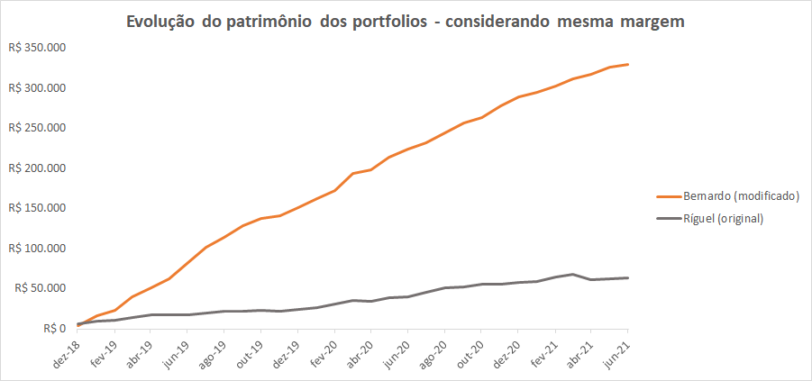
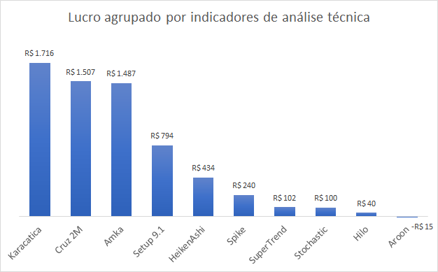
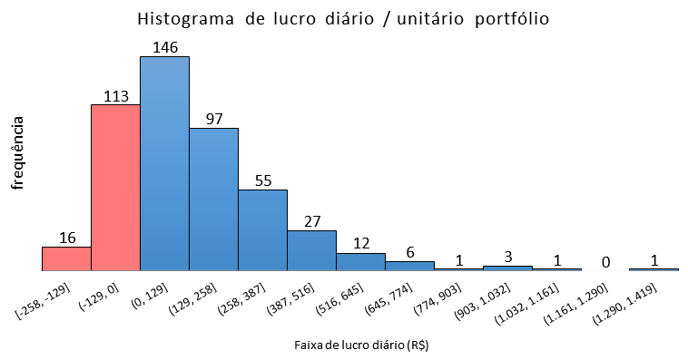
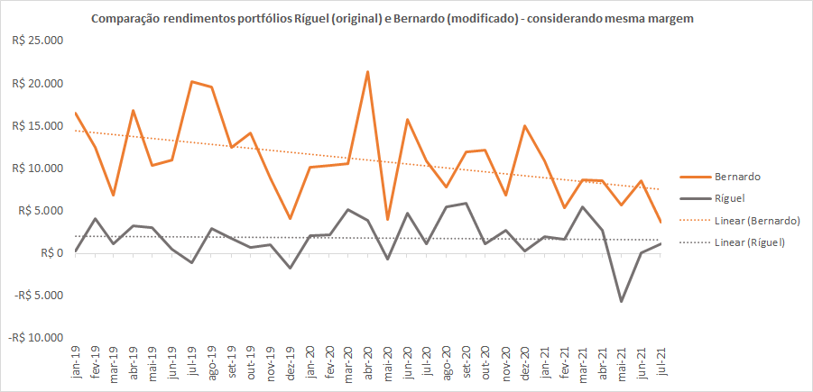

# Portfolio
---
## Data Sciente

### Portfolio de robôs investidores

Ao investir com uma sugestão de portfólio de robôs investidores (Agorithmic trading) existente no mercado, verifiquei um alto rebaixamento e capital necessário recomendado maior do que possuía.

Analisei cada robô (set) de forma individual através de relatórios do backtest (recurso do software Metatrader), para verificar o rendimento passado de cada estratégia. Acrescentei outros indicadores financeiro, ativos e diversifiquei os tempos gráficos de operação. Eliminei os sets menos lucrativos e/ou com os maiores rebaixamentos. Verifiquei quais apresentaram uma acurácia razoável (operações reais vs. backtest).

Com as adequações citadas foi possível diminuir o rebaixamento financeiro e garantia inicial, além do aumento do fator de lucro.

Apesar da melhora dos resultados, podemos observar uma queda dos resultados financeiros (topos e fundos descendentes). Com isso faz-se necessário desenvolvimento contínuo para idenfiticar melhorias/correções frente às mudanças do mercado financeiro.
  
  

  
  

  
  

  
  

  

---

Page template forked from <a href="https://github.com/evanca/quick-portfolio">evanca</a>

<!-- Remove above link if you don't want to attibute -->
