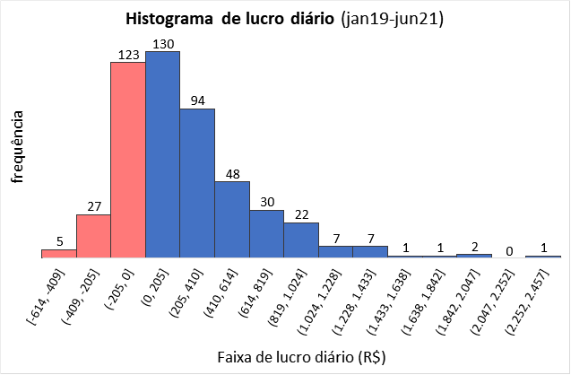

# Portfolio
---
## Data Sciente

### Portfolio de robôs investidores

  Ao investir com uma sugestão de portfólio de robôs investidores (Agorithmic trading) existente no mercado, verifiquei um alto rebaixamento e capital inicial sugerido maior do que possuía.  

  Analisei cada robô (set) de forma individual através de relatórios de backtest (recurso do software Metatrader), para verificar o rendimento passado de cada estratégia. Acrescentei outros indicadores financeiros, ativos e diversifiquei os tempos gráficos de operação. Eliminei os sets menos lucrativos e/ou com os maiores rebaixamentos. Verifiquei quais apresentaram uma acurácia razoável (operações reais vs. backtest).  

   

   

  Com as adequações citadas, o rebaixamento financeiro dimimuiu em 78%, exigindo menor garantia inicial. Foi observado também aumento do fator de lucro: de 2,09 para 7,98.  
  
   

   
   

   

  Apesar da melhora dos resultados, podemos observar uma queda dos lucros na série temporal (topos e fundos descendentes). Com isso faz-se necessário um desenvolvimento contínuo para idenfiticar melhorias/correções frente às mudanças do mercado financeiro.  

   

   
  

  

---

Page template forked from <a href="https://github.com/evanca/quick-portfolio">evanca</a>

<!-- Remove above link if you don't want to attibute -->
